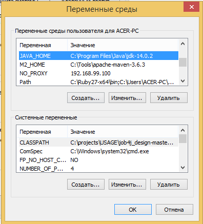
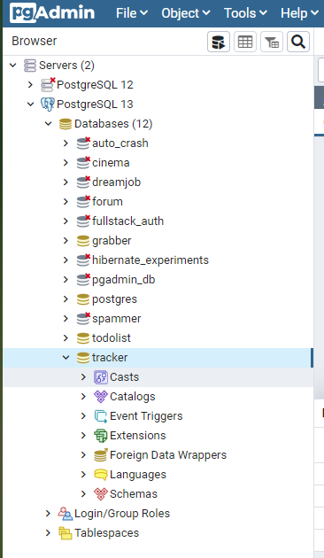

# Проект - Tracker
| Technology | Badge |
|:----------:|:------:|
| Travis CI |  |
| Code Coverage |  |

# Содержание
* [Использованные технологии](#Использованные-технологии)
* [О проекте](#О-проекте)
* [Сборка](#Сборка)
* [Использование](#Использование)
* [Контакты](#Контакты)
## Использованные технологии
* Checkstyle plugin
* JaCoCo
* Travis CI
* Liquibase
* Collections Framework
* PostgreSQL
* JDBC
* Hibernate
* JUnit 4
* Mockito
* HSQLDB
## О проекте
Проект представляет собой CRUD-систему заявок. Исходный код проекта располагается 
в пакете ru.job4j.tracker. Главный класс - StartUI. Интерфейс системы консольный.
Все заявки хранятся на сервере баз данных PostgreSQL. Работа с БД осуществляется через JDBC.
Возможно выполнять следующие действия с заявками:
0. Create a new item - Создать новую заявку
1. Show all items - Вывести список всех заявок
2. Edit item - Отредактировать заявку
3. Delete item - Удалить заявку
4. Find item by Id - Найти заявку по id
5. Find items by name - Вывести список всех заявок с одинаковым названием
6. Exit - Выйти

Общая диаграмма зависимостей компонентов:  
  
1. Класс __*StartUI*__ - главный класс. Отвечает за показ консольного меню и за взаимодействие с пользователем.
2. Класс __*Item*__ - модель данных (объект заявки). Содержит в себе id заявки, наименование и дату создания. 
3. Интерфейс __*Input*__ - используется для организации взаимодействия с пользователем. 
Реализуется тремя классами: StubInput, ConsoleInput, ValidateInput.
4. Класс __*StubInput*__ - необходим в целях тестирования в качестве заглушки.
5. Класс __*ConsoleInput*__ - использует класс *java.util.Scanner* для обработки пользовательского ввода
6. Класс __*ValidateInput*__ - использует шаблон *"Декоратор"*. 
Оборачивает класс *ConsoleInput*, валидируя пользовательский ввод.
7. Интерфейс __*Store*__ - используется для организации взаимодействия с БД. 
Реализуется тремя классами: *MemTracker*, *SqlTracker*, *HbmTracker*.
8. Класс __*MemTracker*__ - посредством Collections Framework осуществляет хранение заявок в памяти.
9. Класс __*SqlTracker*__ - отвечает за работу с БД (CRUD-операции) через JDBC.
10. Класс __*HbmTracker*__ - отвечает за работу с БД (CRUD-операции) c помощью Hibernate.
11. Интерфейс __*UserAction*__ - отвечает за выполнение различных действий с заявками.
За счёт данного интерфейса возможно расширять систему (добавлять новые действия с заявками). 
Реализуется семью классами: *CreateAction*, *DeleteAction*, *ExitAction*, *FindAllAction*, 
*FindByIdAction*, *FindByNameAction*, *ReplaceAction*.
12. Классы __*CreateAction*__, __*DeleteAction*__, __*ExitAction*__, __*FindAllAction*__, 
__*FindByIdAction*__, __*FindByNameAction*__, __*ReplaceAction*__ - 
осуществляют соответствующие действия с заявками.
13. Интерфейс __*Output*__ - необходим для организации консольного вывода. 
Реализуется двумя классами: *ConsoleOutput*, *StubOutput*.
14. Класс __*ConsoleOutput*__ - осуществляет консольный вывод в *System.out*.
15. Класс __*StubOutput*__ - необходим в целях тестирования в качестве заглушки.
## Сборка
1. Установить JDK 14.
2. Скачать Maven.
3. Создать переменные окружения JAVA_HOME и M2_HOME и прописать в переменную окружения Path 
пути до бинарных файлов для JDK и для Maven:  
  
4. Установить сервер БД PostgreSQL. При установке задать: имя пользователя - postgres, 
пароль - root, порт - 5432. Также при установке сервера БД PostgreSQL нужно установить программу pg_Admin.
5. Скачать исходный код проекта с GitHub.
6. Перейти в корень проекта, где лежит файл pom.xml:  
 
  
7. С помощью Maven осуществить сборку проекта:  
  
При успешной сборке должна появиться папка target, в которой располагается jar-архив tracker.jar:  
 
 
  
8. Запустить сервер БД, указав путь до папки data:  
  
9. Запустить программу pg_Admin, установленную вместе с сервером БД PostgreSQL:  
  
10. Создать БД с названием tracker:  
  
11. Открыть Query Tool для созданной БД и запустить SQL-скрип create.sql, 
находящийся в папке db/scripts (данная папка находится в корне скачанного проекта):  
 
 
## Использование
Теперь, когда jar-архив собран и БД подготовлена можно запускать jar-архив:  
  
Добавим три заявки:  
  
Выведем все заявки:  
  
Найдём вторую заявку по id:  
  
Удалим вторую заявку:  
  
Отредактируем первую заявку:  
  
Выведем все заявки:  
  
Найдём заявки по имени, предварительно добавив несколько заявок с одинаковым именем:  
  
Выйдем из программы:  
 
## Контакты
Почта: dmitry_yugay@mail.ru 
Skype: live:.cid.9cdc925fb48220b4

